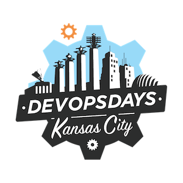

<h1 align="center">Welcome to DevOpsDays KC</h1>

  

<h4 align="center">
  <b><a href="https://devopsdayskc.org/">Website</a></b>
  •
  <b><a href="https://docs.devopsdayskc.org">Organizer Documentation</a></b>
  •
  <b><a href="https://www.meetup.com/devops-kansas-city/">DevOps KC Meetup</a></b>
  •
  <a href="https://www.youtube.com/c/devopskc">Event Videos</a>
  •
  <a href="https://www.linkedin.com/company/devopsdayskc">LinkedIn</a>
  •
  <a href="https://twitter.com/OSSInsight">Twitter</a>
</h4>

## Introduction

DevOpsDays KC is a local, community-run event that is part of the global [DevOpsDays](https://devopsdays.org) worldwide series of technical conferences covering topics of software development, IT infrastructure operations, and the intersection between them.

## Contact Us

If you're interested in finding out more about DevOpsDays KC, or would like to sponsor our events, please contact us at kansas-city@devopsdays.org.
